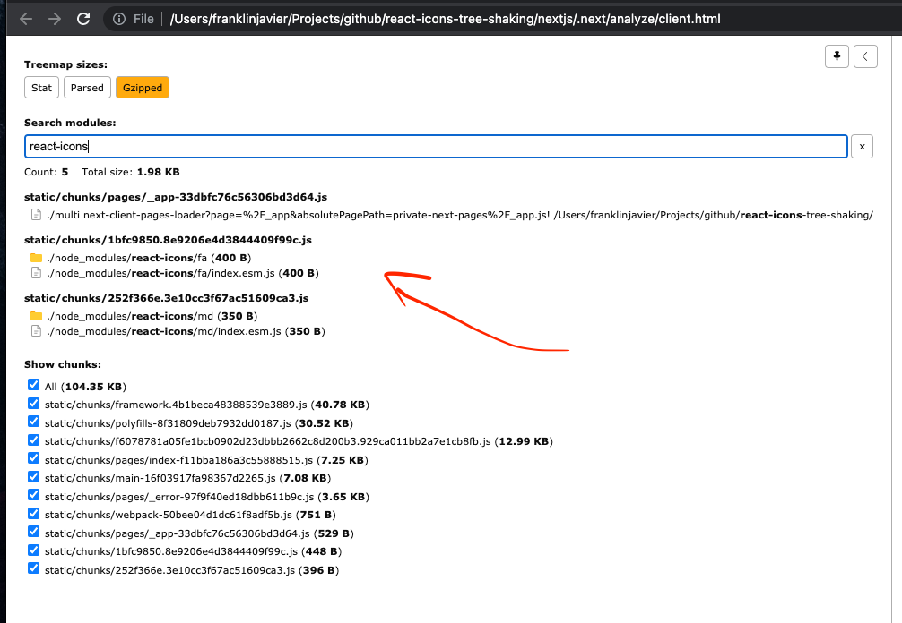
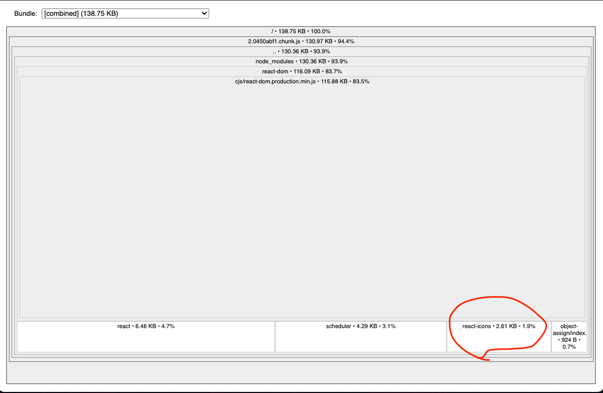

# react-icons-tree-shaking

## Bundle analyzer

Importing 3 icons from 2 packages

```jsx
import { FaBeer } from 'react-icons/fa'
import { MdAccountBox, MdCheckCircle } from 'react-icons/md'

<>
  <FaBeer />
  <MdAccountBox />
  <MdCheckCircle />
</>
```

### nextjs



### create react app


